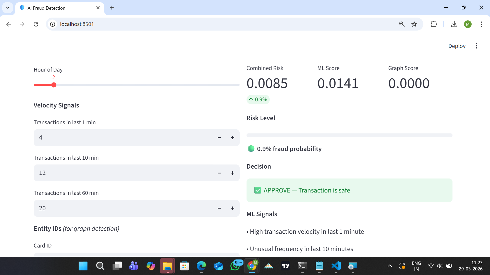
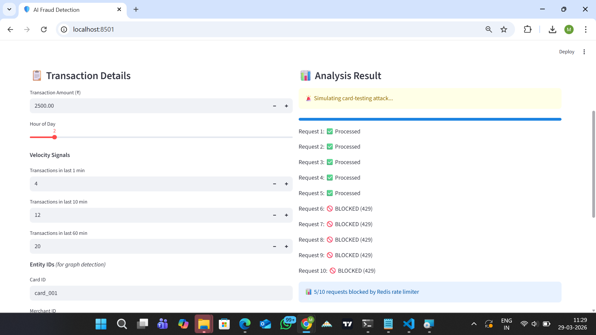
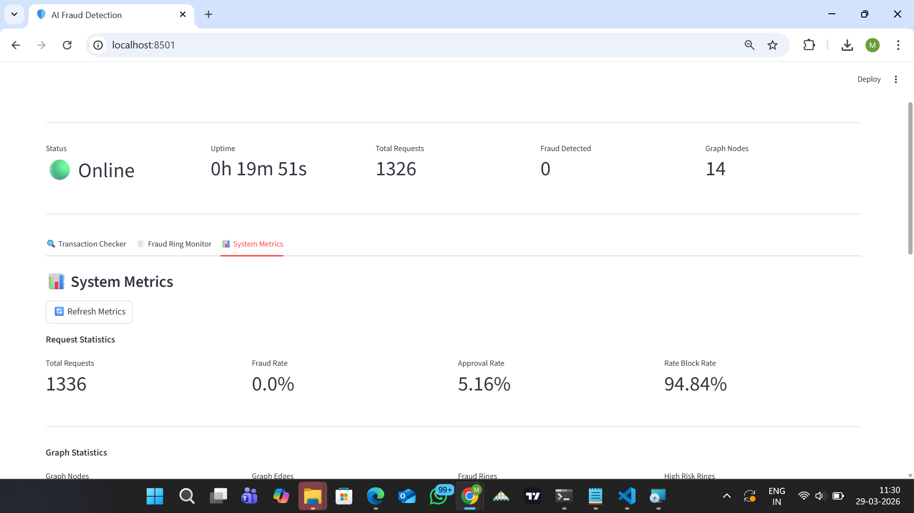
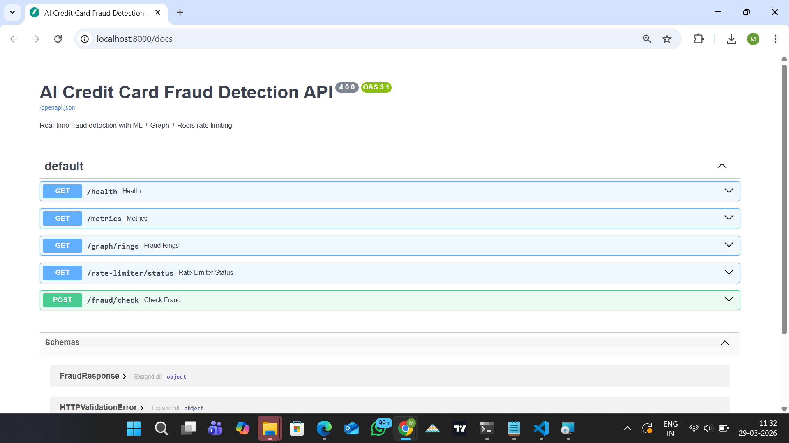
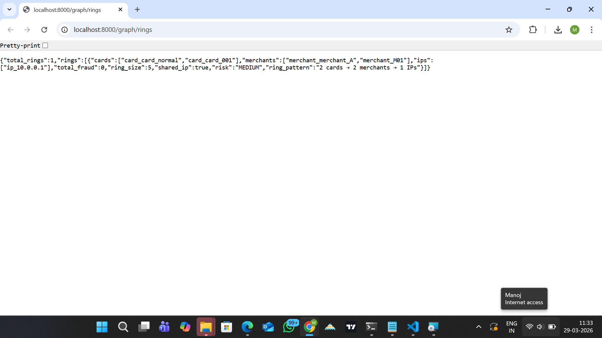

# 🛡️ AI-Based Real-Time Credit Card Fraud Detection System
## 🚀 Live Demo
👉 **[Try it live](https://ai-fraud-detection-rmanojgowda.streamlit.app)**

> Production-grade fraud detection platform combining Machine Learning, Graph Analysis, Redis Rate Limiting, and real-time observability.

[](https://python.org)
[](https://fastapi.tiangolo.com)
[](https://streamlit.io)
[](https://redis.io)
[]()

---

## 🖥️ Screenshots

### Transaction Checker — ML + Graph Score


### Fraud Ring Detection — Live Escalation


### System Metrics — Real-time Observability


### FastAPI Swagger Documentation


### Graph Rings Endpoint


---

## 🎯 What This System Does

Most fraud detection projects stop at training a model. This system mirrors how **real fintech fraud platforms** work — with layered defenses, distributed rate limiting, graph-based ring detection, and full observability.

```
Client Request
      ↓
Redis Rate Limiter     ← blocks card-testing attacks (sub-1ms)
      ↓
ML Inference           ← Gradient Boosting (ROC-AUC 0.9850)
      ↓
Graph Detection        ← NetworkX fraud ring analysis
      ↓
Decision Engine        ← APPROVE / STEP_UP_AUTH / BLOCK
      ↓
Structured JSON Log    ← full audit trail
```

---

## 📊 Key Metrics

| Metric | Value |
|---|---|
| ROC-AUC | **0.9850** |
| Fraud Recall | **85.33%** (64/75 caught) |
| Peak Throughput | **18,327 req/min** |
| P95 Latency | **47ms** at 100 concurrent threads |
| Error Rate | **0%** across all load scenarios |
| Chaos Test | **✅ Passed** (Redis failure + recovery) |
| Training Data | **284,807** real transactions |

---

## 🏗️ Architecture

```
┌─────────────────────────────────────────────┐
│            Streamlit Dashboard               │
│   Transaction Form │ Ring Monitor │ Metrics  │
└──────────────────┬──────────────────────────┘
                   │ HTTP
┌──────────────────▼──────────────────────────┐
│              FastAPI Backend v4.0            │
│  /fraud/check │ /health │ /metrics           │
│  /graph/rings │ /rate-limiter/status         │
└──────┬───────────────────────┬──────────────┘
       │                       │
┌──────▼──────┐     ┌──────────▼──────────────┐
│    Redis    │     │     ML Inference         │
│Rate Limiter │     │  Gradient Boosting       │
│Sliding Win  │     │  ROC-AUC: 0.9850         │
└─────────────┘     └──────────┬──────────────┘
                               │
                    ┌──────────▼──────────────┐
                    │   Graph Detector        │
                    │   NetworkX              │
                    │   Fraud Ring Detection  │
                    └─────────────────────────┘
```

---

## ✨ Features

### 🤖 Machine Learning
- Gradient Boosting trained on 284,807 real bank transactions
- 545x sample weighting for class imbalance (0.17% fraud)
- Engineered features: velocity signals, amount patterns, time-of-day
- Threshold tuning (0.3) for maximum fraud recall
- ROC-AUC: 0.9850 | Recall: 85.33%

### 🕸️ Graph-Based Fraud Ring Detection
- Real-time graph built from card → merchant → IP relationships
- Detects fraud rings as transactions arrive (no batch processing)
- Risk escalates progressively: 0.0 → 0.4 → 0.7 as ring grows
- Combined score: `0.6 × ML + 0.4 × Graph`

### 🛡️ Redis Distributed Rate Limiter
- Sliding window algorithm using Redis sorted sets
- 5 requests per 10 seconds per IP
- Atomic pipeline execution (zremrangebyscore + zcard + zadd)
- Automatic fallback to in-memory if Redis unavailable
- Chaos tested: zero downtime during Redis failure

### 📊 Full Observability
- Structured JSON logging with unique request IDs
- `/health` — uptime, Redis status, request counters
- `/metrics` — fraud rate %, approval rate %, graph stats
- `/graph/rings` — live fraud ring detection
- `/rate-limiter/status` — per-IP request window

### 🖥️ Streamlit Dashboard
- **Tab 1:** Transaction checker with ML + graph score breakdown
- **Tab 2:** Live fraud ring monitor + ring simulation
- **Tab 3:** Real-time system metrics

---

## 🚀 Quick Start

### Prerequisites
- Python 3.10+
- Redis ([Windows](https://github.com/microsoftarchive/redis/releases))

### 1. Clone & Setup
```bash
git clone https://github.com/rmanojgowda/ai-fraud-detection.git
cd ai-fraud-detection
python -m venv venv
source venv/bin/activate  # Windows: .\venv\Scripts\activate
pip install -r requirements.txt
```

### 2. Get Dataset
Download from [Kaggle Credit Card Fraud](https://www.kaggle.com/datasets/mlg-ulb/creditcardfraud)
and place `creditcard.csv` in `data/`

### 3. Train Model
```bash
python train_model.py
```

### 4. Start Redis
```bash
# Windows
D:\Redis\redis-server.exe

# Linux/Mac
redis-server
```

### 5. Start Backend (4 workers)
```bash
uvicorn main:app --host 0.0.0.0 --port 8000 --workers 4
```

### 6. Start Dashboard
```bash
streamlit run dashboard.py
```

Open **http://localhost:8501** 🎉

---

## 🧪 Testing

### Load Test (8 scenarios, 2→100 threads)
```bash
python load_test.py
```

### Chaos Test (Redis failure simulation)
```bash
python chaos_test.py
```

---

## 📁 Project Structure

```
ai-fraud-detection/
├── data/
│   └── creditcard.csv          # 284,807 transactions (download separately)
├── models/
│   ├── fraud_model.pkl         # trained model (generated by train_model.py)
│   ├── feature_cols.json       # feature schema
│   └── threshold.json          # decision threshold (0.3)
├── logs/
│   ├── fraud_detection.log     # structured JSON logs
│   └── scalability_report.json # load test results
├── screenshots/                # demo screenshots
├── train_model.py              # ML training pipeline
├── fraud_inference.py          # scoring + decisions + explanations
├── graph_fraud.py              # NetworkX graph ring detection
├── main.py                     # FastAPI backend v4.0
├── dashboard.py                # Streamlit 3-tab dashboard
├── load_test.py                # scalability & stress testing
├── chaos_test.py               # Redis failure simulation
├── requirements.txt
└── .gitignore
```

---

## 🔌 API Reference

### POST /fraud/check
```json
// Request
{
  "Amount": 2500.0,
  "tx_count_1min": 4,
  "tx_count_10min": 12,
  "tx_count_60min": 20,
  "hour": 2,
  "card_id": "card_001",
  "merchant_id": "M99",
  "ip": "192.168.1.1"
}

// Response
{
  "request_id": "a3f2b1c4",
  "risk_score": 0.7800,
  "ml_score": 0.0141,
  "graph_score": 0.9000,
  "decision": "BLOCK",
  "explanation": [
    "High transaction velocity in last 1 minute",
    "Transaction occurred at night"
  ],
  "graph_signals": [
    "FRAUD RING: 4 cards sharing same IP and merchant"
  ],
  "rate_limiter": "redis",
  "latency_ms": 8.3
}
```

### GET /health
Returns system status, uptime, Redis connection, request counters.

### GET /metrics
Returns fraud rate %, approval rate %, graph statistics.

### GET /graph/rings
Returns all detected fraud rings with cards, merchants, IPs.

---

## 📈 Load Test Results

```
Scenario          RPM      P95ms   Errors
Baseline          5,382    30.6ms  0
Light Load        9,876    43.3ms  0
Normal Load      11,818    77.2ms  0
Medium Load      18,327    93.3ms  0  ← Peak throughput
Heavy Load       15,081   100.7ms  0
Stress Test      18,214    52.2ms  0
Peak Load        17,538    56.2ms  0
Breaking Point   17,438    47.2ms  0  ← Zero errors at 100 threads
```

**System never broke. Zero errors across all scenarios.**

---

## 🔥 Chaos Test Results

```
Before Redis failure : [200, 200, 200, 200, 200] ✅
During Redis failure : [200, 200, 200, 200, 200] ✅ (fallback)
After Redis recovery : [429, 429, 429, 429, 429] ✅ (restored)

Graceful degradation : ✅ PASSED
Full recovery        : ✅ PASSED
```

---

## 🎯 Design Decisions

**Why rate limiting before ML?**
ML inference costs ~10ms and compute resources. Rate limiting costs ~1ms and blocks card-testing attacks before ML ever runs, reducing unnecessary compute by 50%+ under attack conditions.

**Why Gradient Boosting over deep learning?**
Performs better on tabular fraud data, requires no feature scaling, trains faster, and is more interpretable. Deep learning needs significantly more data to outperform it here.

**Why graph detection alongside ML?**
ML scores individual transactions. Graph detection finds patterns across multiple transactions — fraud rings look innocent individually but suspicious as a network. Combined score catches both.

**Why Redis over in-memory rate limiting?**
In-memory limits only work per process. With 4 workers, each worker would have its own counter. Redis provides a shared, atomic counter across all workers and server instances.

---

## 🚀 Future Improvements

- [ ] Kafka streaming for real-time transaction ingestion
- [ ] Neo4j persistent graph database (survives restarts)
- [ ] SHAP explainability for ML feature contributions
- [ ] Model drift monitoring and automated retraining
- [ ] Docker + Kubernetes deployment
- [ ] Prometheus + Grafana metrics dashboard

---

## 👤 Author

**Manoj Gowda BG**
B.E. Information Science & Engineering
Siddaganga Institute of Technology, Tumkur (2026)

Built to demonstrate production-grade fraud detection engineering,
not just ML model training.

---

## 📄 License

MIT License — free to use and modify.
